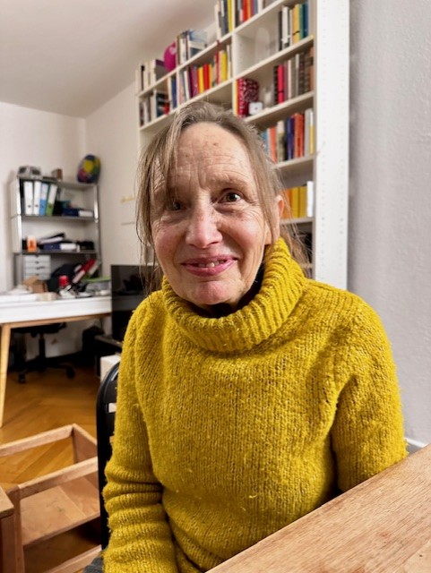

+++
title = "\"Dieses schwer zu greifende Stück selbst\""
date = "2025-03-12"
draft = false
pinned = true
image = ""
footnotes = ""
+++


Mechtild Greven, meine Grossmutter, wuchs im Deutschland der Nachkriegszeit auf. Sie erlebte als junge Schauspielerin die Achtundsechziger Bewegung, das Wirtschaftswunder und den Kalten Krieg mit. Später zog sie mit ihrer Familie in die Schweiz. Ich versuche herauszufinden, wie sich ihre Identität im Laufe dieser Zeit entwickelt hat.  



**Was bedeutet Identität für dich persönlich?**

Für mich ist Identität sehr stark mit dem Bewusstsein verbunden, dass ich einen Namen habe, sowie mit Erinnerungen an bestimmte Erlebnisse.

<!--StartFragment-->



Mechtild Greven wurde 1946 in der Eiffel geboren und wohnt seit 1981 in der Schweiz. Sie ist ausgebildete Schauspielerin, ausserdem besitzt einen Doktortitel in Germanistik. Sie ist zweifache Mutter und fünffache Grossmutter. 

<!--EndFragment-->

**Welchen Einfluss hatte der Kulturkreis, in dem du aufgewachsen bist auf die Entwicklung deiner Identität?**

Ich glaube ich habe mich sehr mit der Kultur in Deutschland identifiziert, schliesslich bin ich dort aufgewachsen. Doch da ich jetzt in der Schweiz wohne, merke ich, dass ein gewisser Wandel vorgefallen ist, dass ich anders denke, eben mehr schweizerisch.

> *"In der Schweiz wird viel mehr einfach akzeptiert."*

**Könntest du mir ein Beispiel geben für so einen Unterschied?**

Ich hatte immer das Gefühl, dass in Deutschland ein viel grösserer Fokus darauf liegt, sich als klug zu beweisen, was natürlich auch mit der Atmosphäre, in der ich aufgewachsen bin, zusammenhängt. In der Schweiz wird viel mehr einfach akzeptiert.

**Welchen Einfluss hatten gesellschaftliche Veränderungen auf deine Wahrnehmung von  Identität?**

Ich bin natürlich Teil der sogenannten Achtundsechziger Generation. Damals ist sehr viel Gesellschaftliches hinterfragt worden. Ich und junge Menschen allgemein lebten ein wenig in der Revolte. Unvermeidlich waren deswegen auch die Auseinandersetzungen mit sehr extremen Bewegungen der Achtundsechziger, meinetwegen der RAF. In diesem Fall war für mich klar, dass solche radikalen Einstellungen für mich gar nicht in Frage kommen. So etwas finde ich schrecklich.

**Wo wir gerade dabei sind, wie und in welcher Weise haben dich historische Ereignisse, beispielsweise der kalte Krieg, geprägt?**

Der kalte Krieg, das war einfach eine Realität. Deutschland war geteilt in die Bundesrepublik und die DDR, und man hörte sehr viel von Flüchtenden aus der DDR. An der Grenze gab es immer wieder Schießereien. Ich erinnre noch mich an Zeitungsüberschriften wie: «Wieder zwei Tote an Grenzübergang XY». Das erzeugt schon eine sehr angespannte Atmosphäre. Es existierte insgesamt eine gewisse Furcht vor den «Russen» und allgemein den Ostblock betreffend. Ich hatte auch Erlebnisse an der innerdeutschen Grenze, zum Beispiel, als ich für einer Tour mit der Maturklasse nach Berlin gefahren bin. Als wir den Ostsektor besuchten, haben wir, obwohl wir bloss Schüler waren, in gewisser Weise die Härte dieses Konflikts erfahren. Ein Mädchen aus unserer Klasse wurde an der Grenze verhört, niemand wusste, weshalb. Als sie wiederkam, weinte sie. Das sind schon schockierende Momente, die einen auch prägen.

**Wie stehst du zu Identität und Arbeit? Ich persönlich habe das Gefühl, dass es hier teilweise verschiedene Auffassungen zwischen den Generationen gibt. Inwieweit denkst du, sind Identität und Arbeit korreliert?**

Ich denke schon, dass es da einen Zusammenhang gibt. Wie ich es erfahren habe, aus dieser Haltung des Widerstands gegen die bürgerliche Gesellschaft. Ich hatte zum Beispiel den Willen, Schauspielerin zu werden, ich wollte Künstler sein und Künstler genossen, zumindest damals, eine gewisse Narrenfreiheit. Man fühlte sich zu einer Gruppe, die außerhalb, die am Rande existierte, zugehörig und wollte das einfache Alltagsleben hinter sich lassen, um größere Zusammenhänge in den Blick zu bekommen. Und das prägt natürlich auch sehr die eigene Identität.

**Was denkst du, wie hat sich deine Identität mit dem Älterwerden verändert? Es gibt ja die Auffassung, dass man im Alter gelassener und weiser werde. Wie hast du das erlebt?**

Als ich jünger war, brauchte ich, metaphorisch gesehen, Krücken, um ein Gefühl von mir selbst, um meine Identität zu spüren. So war es für mich sehr wichtig, mich mit einer künstlerischen Aufgabe identifizieren zu können und das brauche ich nun weniger. Trotzdem lebt das natürlich immer noch in mir. Aber ich brauche das nicht mehr so nach aussen zu tragen. Vielleicht ist das ein Ausdruck davon, dass ich mehr in mir selbst ruhe.

**Inwieweit wird Identität von aussen geprägt, beziehungsweise kommt ein Wandel auch von einem selbst?**

Ich denke, da ist schon ein großer Anteil, der auch von einem selbst kommt. Man überrascht sich mehr oder weniger selbst. Ich würde sogar sagen, auch wenn man in einer Umgebung lebt, mit der man sich sehr stark verbindet, trägt man letzten Endes immer dieses schwer zu greifende Stück selbst in sich. Es gibt Theorien, die besagen, dass alles nur von äusseren Faktoren bestimmt wird, aber das habe ich nicht so erfahren.

> *"Wir merken, dass wir das Verlässliche ankratzen, und dass es deshalb bald nicht mehr so verlässlich sein könnte."*

**Hat sich das Bedürfnis, zu einer Gemeinschaft zu gehören, verändert?**

In gewisser Weise erlebe ich, dass mein Bewusstsein, Teil von etwas zu sein, grösser geworden ist. In jungen Jahren war mein ich-Gefühl distanzierter. Jetzt bin ich in einer Situation, in der man weniger Kraft hat und sich nicht mehr in seiner vollen Blüte befindet. Dafür habe ich einen besseren Überblick und mehr Zeit über Dinge nachzudenken.

**Denkst du, dass die Auseinandersetzung mit dem Thema Natur und dem Einfluss, den die Menschheit darauf hat, verändert, wie man sich selbst und die Menschheit als Ganzes wahrnimmt?**

Natürlich. Wir sehen ja, dass wir der Natur grosse Probleme bereiten. Von dem her hoffe ich, dass es zu mehr Einsicht kommt und man einen Weg findet, der Natur nicht zu schaden, sondern mit ihr umzugehen, wie es ihr, aber auch einem selbst gemäß ist. Diese Erschütterung, die wir im Moment erleben, geht ins Existenzielle und bedrängt einen. Man hat das Gefühl, man muss dankbar sein, dass die Natur überhaupt noch ist, wie sie ist. Wir merken, dass wir das Verlässliche ankratzen, und dass es deshalb bald nicht mehr so verlässlich sein könnte. Die Natur ist letzten Endes die Grundlage unseres Lebens.